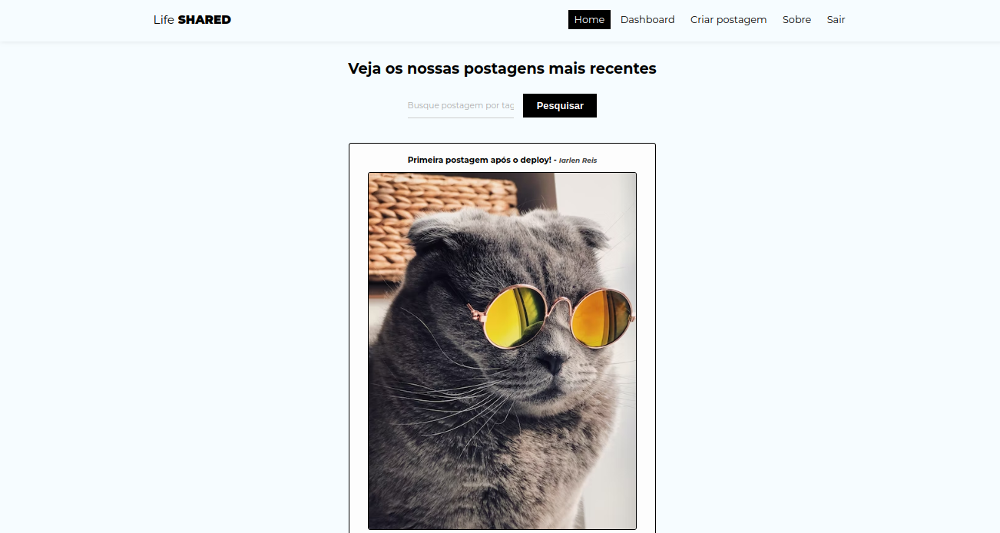

# Life Shared

## Description

O life shared é um blog feito em <b>react com itegração com <b>firebase, ele possui sistema de autenticação através de E-mail e senha.
O life shared possui um sistema de roteamento utilizando <b>react-router-dom tendo <b>rotas públicas e <b>privadas.  

### Routes public:

* /home
* /about
* /login
* /register
* /posts/:id

### Routes private:

* /dasboard
* /posts/create
* /posts/edit/:id

## Tools

Ferramentas utilizadas no desenvolvimento.

React js  
[@ReactJs](https://pt-br.reactjs.org/)

React Router Dom V6  
[@ReactRouterDom](https://reactrouter.com/en/main)

Google Firebase  
[@Firebase](https://firebase.google.com/)

HTML 5  
[@HTML5](https://developer.mozilla.org/pt-BR/docs/Web/HTML)

CSS 3  
[@CSS3](https://developer.mozilla.org/pt-BR/docs/Web/CSS)

Unsplash (Images)  
[@Unsplash](https://unsplash.com/pt-br)

## Acknowledgments

Inspiration, code snippets, etc.
* [Matheus Battisti](https://github.com/matheusbattisti)
